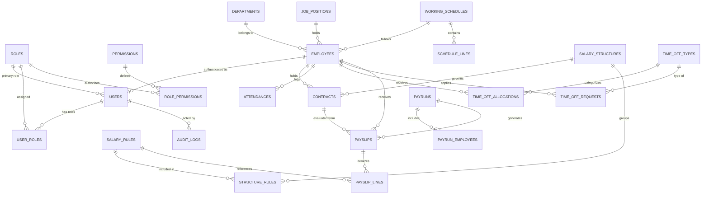

# 🚀 PeoplePay360 — Enterprise HRMS & Automated Payroll Platform

[](https://nodejs.org/)
[](https://reactjs.org/)
[](https://vitejs.dev/)
[](https://tailwindcss.com/)
[](https://www.material-tailwind.com/)
[](https://www.mysql.com/)
[](LICENSE)

**PeoplePay360** is a comprehensive, production-grade **Human Resource Management System (HRMS) & Payroll Automation Platform** inspired by modern enterprise ERP architectures (such as Odoo and Workday). It delivers full-lifecycle workforce management—from employee onboarding, dynamic multi-role RBAC, contract lifecycle management, working schedule matrices, and real-time attendance tracking to configurable rule-based salary calculation, batch payrun execution, itemized payslip printing, and executive business intelligence.

---

## 📑 Table of Contents

- [Key Highlights & Architecture Principles](#-key-highlights--architecture-principles)
- [System Architecture](#-system-architecture)
- [Tech Stack](#-tech-stack)
- [Comprehensive Feature & Module Breakdown](#-comprehensive-feature--module-breakdown)
  - [1. Executive Analytics & Real-Time Dashboard](#1-executive-analytics--real-time-dashboard)
  - [2. 360° Employee Directory & Dossier](#2-360-employee-directory--dossier)
  - [3. Dynamic Multi-Role RBAC & User Administration](#3-dynamic-multi-role-rbac--user-administration)
  - [4. Working Schedules & Shift Matrices](#4-working-schedules--shift-matrices)
  - [5. Smart Attendance Engine & Check-In Widget](#5-smart-attendance-engine--check-in-widget)
  - [6. Time Off, Leave Quotas & Approval Workflows](#6-time-off-leave-quotas--approval-workflows)
  - [7. Employment Contracts & Wage Governance](#7-employment-contracts--wage-governance)
  - [8. Salary Structures & Formula Rules Engine](#8-salary-structures--formula-rules-engine)
  - [9. Batch Payruns & Itemized Payslips](#9-batch-payruns--itemized-payslips)
- [Payroll Calculation & Rules Engine Algorithm](#-payroll-calculation--rules-engine-algorithm)
- [Database Schema & ER Diagram](#-database-schema--er-diagram)
- [Quick Start & Setup Guide](#-quick-start--setup-guide)
  - [Prerequisites](#prerequisites)
  - [1. Clone Repository](#1-clone-repository)
  - [2. Backend Setup & Database Migration](#2-backend-setup--database-migration)
  - [3. Frontend Setup](#3-frontend-setup)
- [Demo User Credentials](#-demo-user-credentials)
- [API Documentation Reference](#-api-documentation-reference)
- [Project Directory Structure](#-project-directory-structure)
- [Troubleshooting](#-troubleshooting)

---

## 🎯 Key Highlights & Architecture Principles

- **ACID-Compliant Point-in-Time Data Freezing**: Whenever a payrun is executed, the contract terms, wage rates, and salary rule definitions are snapshotted to guarantee that historical payslips remain immutable even if an employee's contract or department changes later.
- **Dynamic Multi-Role RBAC**: Users can be assigned multiple roles simultaneously (e.g., both *HR Manager* and *HR Payroll Manager*). Granular permission codes are aggregated dynamically per request across all assigned roles.
- **Non-Cached Real-Time Aggregations**: Dashboard metrics and trend reports query live database views (`vw_payroll_summary`, `vw_attendance_overview`, `vw_monthly_payroll_trend`, `vw_time_off_summary`), ensuring 100% data consistency.
- **Configurable Salary Formulas**: Salary rules support fixed amounts, percentage-based calculations referencing base rules (e.g., `HRA = 40% of BASIC`, `PF = 12% of BASIC`), and sequence-governed evaluation orders.
- **Production-Ready Seed Dataset**: Pre-populated with 22+ employees across 8 departments, 24 job positions, 5 working schedules, 110+ attendance logs, 52 time-off allocations, 25 leave requests, 6 payruns, and 132 payslips.

---

## 🏗️ System Architecture

```
┌────────────────────────────────────────────────────────────────────────┐
│                          React 18 SPA Frontend                         │
│     (Vite • Tailwind CSS • Material Tailwind • Heroicons • Recharts)   │
└───────────────────────────────────┬────────────────────────────────────┘
                                    │ HTTP REST APIs (JSON)
                                    │ Bearer JWT Authentication
┌───────────────────────────────────▼────────────────────────────────────┐
│                          Express.js REST API                           │
│        (JWT Verification • Dynamic Multi-Role RBAC • Error Handler)    │
└─────────┬─────────────────────────┬──────────────────────────┬─────────┘
          │                         │                          │
┌─────────▼─────────┐     ┌─────────▼─────────┐      ┌─────────▼─────────┐
│  Auth & Users API │     │ Workforce & Leaves│      │   Payroll Engine  │
│(BCrypt • JWT Sign)│     │ (Employees, Times)│      │(Rules, Payruns)   │
└─────────┬─────────┘     └─────────┬─────────┘      └─────────┬─────────┘
          │                         │                          │
┌─────────┴─────────────────────────┴──────────────────────────┴─────────┐
│                       MySQL 8.x Database (InnoDB)                      │
│        (Relational Tables • Foreign Keys • Indexes • Schema Views)     │
└────────────────────────────────────────────────────────────────────────┘
```

---

## 🛠️ Tech Stack

### Frontend
- **Framework**: [React 18.3](https://react.dev/) + [Vite 5.4](https://vitejs.dev/)
- **UI & Styling**: [Tailwind CSS 3](https://tailwindcss.com/) + [Material Tailwind](https://www.material-tailwind.com/)
- **Icons**: [@heroicons/react](https://heroicons.com/)
- **Charts & Data Viz**: [Recharts](https://recharts.org/)
- **Routing**: [React Router DOM v6](https://reactrouter.com/)
- **HTTP Client**: [Axios](https://axios-http.com/) (with automatic Authorization header interceptors)

### Backend
- **Runtime**: [Node.js](https://nodejs.org/) (ES6+ / CommonJS)
- **Framework**: [Express.js v4](https://expressjs.com/)
- **Database Driver**: [mysql2](https://github.com/sidorares/node-mysql2) (Promise-based Connection Pooling)
- **Security**: [bcrypt](https://www.npmjs.com/package/bcrypt) (Salt Rounds: 10), [jsonwebtoken](https://jwt.io/), [helmet](https://helmetjs.github.io/), [cors](https://www.npmjs.com/package/cors)
- **Logging**: [morgan](https://www.npmjs.com/package/morgan)

### Database
- **Engine**: MySQL 8.x (InnoDB with ACID transaction support)
- **Key Views**: `vw_payroll_summary`, `vw_attendance_overview`, `vw_monthly_payroll_trend`, `vw_time_off_summary`

---

## 🌟 Comprehensive Feature & Module Breakdown

### 1. 📊 Executive Analytics & Real-Time Dashboard
The dashboard provides a central command center for business leaders, HR managers, and payroll officers:
- **Live Workforce KPIs**: Active Headcount, Today's Attendance Presence %, Total Monthly Net Payroll Paid, and Pending Leave Requests.
- **Monthly Net Salary Trend**: Multi-month visual trend line chart depicting salary expenditure progressions.
- **Departmental Salary Breakdown**: Interactive horizontal bar chart comparing net wage expenditures across departments.
- **Payslip Status Distribution**: Donut chart tracking draft, computed, confirmed, and paid payslips.
- **Live Attendance Health Card**: Present vs. Late vs. Absent vs. Overtime percentage indicators.

### 2. 👥 360° Employee Directory & Dossier
- **Employee Directory**: Paginated grid and table view with debounced real-time search, department filtering, and status toggles.
- **Comprehensive 360° Dossier**:
  - **Profile Overview**: Personal details, official email, phone, employee code, department, job position, manager hierarchy, and joining date.
  - **Contracts Tab**: Historical and active employment contracts, compensation rates, and wage breakdown.
  - **Attendance Tab**: Clock-in/out timestamps, total daily worked hours, and status badges (`present`, `late`, `overtime`, `absent`).
  - **Time Off Tab**: Allocated balance vs. taken leave days with color-coded request histories.

### 3. 🛡️ Dynamic Multi-Role RBAC & User Administration
- **Granular Permissions Matrix**: 18 distinct data-driven permission codes (`employee.view_all`, `contract.manage`, `payroll.structure.manage`, `system.admin`, etc.).
- **Multi-Role User Assignments**: Assign one or multiple roles per account through the `user_roles` junction table.
- **Dynamic Permission Synthesis**: Permissions are computed on-the-fly at runtime across all active assigned roles.
- **Self-Service Profile Management**: Employees can update personal phone, profile photo, and password while preserving administrative locks on job position and wage.

### 4. ⏱️ Working Schedules & Shift Matrices
- **Customizable Working Schedules**: Full-time 40h standard, engineering shifts, flexible part-time 22h, and sales extended schedules.
- **Shift Line Breakdowns**: Daily start time, end time, and unpaid break minutes used to accurately calculate expected vs. actual working hours.

### 5. 🕒 Smart Attendance Engine & Check-In Widget
- **Interactive Self-Service Clock In/Out**: One-click check-in and check-out with automatic worked hours computation.
- **Punctuality & Overtime Tagging**: Automatic detection of late arrivals and overtime beyond scheduled hours.
- **Manager Corrections & Audit Trail**: HR Managers can correct attendance logs with manual edit flags and supervisor notes.

### 6. 🌴 Time Off, Leave Quotas & Approval Workflows
- **Configurable Leave Types**: Paid Time Off (PTO), Sick Leave, Casual Leave, Unpaid Leave, and Maternity/Paternity Leave.
- **Annual Quota Allocations**: Individual allocations per employee with start and expiry validity periods.
- **Leave Request Lifecycle**: Multi-status workflow (`draft` ➔ `submitted` ➔ `approved` / `refused`).
- **Real-Time Balance Deductions**: Automatically increments `taken_amount` on approved leave requests.

### 7. 📜 Employment Contracts & Wage Governance
- **Contract Lifecycle Management**: States: `draft` ➔ `running` ➔ `expired` / `cancelled`.
- **Wage & Structure Linking**: Ties each contract to a specific **Salary Structure** and **Working Schedule**.
- **Historical Immutability**: Historical contracts are preserved for lifetime auditing and statutory compliance.

### 8. ⚙️ Salary Structures & Formula Rules Engine
- **Salary Structures**: Group salary rules for different employment categories (e.g., Standard Staff, Executive Leadership, Junior/Probation).
- **Rule Categories**: `basic`, `allowance`, `deduction`, `gross`, `net`, and `contribution`.
- **Computation Methods**:
  - **Fixed Amount**: Static allowances/deductions (e.g., Transport Allowance = $300, Health Insurance = $150).
  - **Percentage-Based**: Dynamic percentage calculated against a specified base rule (e.g., `HRA = 40% of BASIC`, `PF = 12% of BASIC`, `Tax = 10% of BASIC`).
  - **Sequence Ordering**: Execution sequence guarantees prerequisite rules are computed before dependent rules.

### 9. 💰 Batch Payruns & Itemized Payslips
- **Multi-Stage Payrun Workflow**: `draft` ➔ `computed` ➔ `validated` ➔ `paid`.
- **Batch Processing**: Generates payslips for all eligible employees in a single transaction.
- **Snapshot Isolation**: Resolves and freezes the contract and wage active during the payrun period.
- **Itemized Payslip Printing**: Generates clean, printer-ready payslip summaries with itemized earnings and deductions.

---

## 🧮 Payroll Calculation & Rules Engine Algorithm

When a payrun is computed, the engine executes the following sequential evaluation:

```
1. Fetch Employee's Active Contract for the Period
   ├── Base Wage = Contract.wage
   └── Salary Structure = Contract.salary_structure_id

2. Order Salary Rules by `structure_rules.sequence` ASC
   ├── Step 1: Rule 'BASIC' (Category: basic)
   │   └── Amount = Base Wage
   │
   ├── Step 2: Rule 'HRA' (Category: allowance, Method: percentage = 40% of 'BASIC')
   │   └── Amount = 0.40 × BASIC
   │
   ├── Step 3: Rule 'SPECIAL' / 'EXEC_ALLOWANCE' (Category: allowance, Method: fixed)
   │   └── Amount = fixed_amount
   │
   ├── Step 4: Compute GROSS EARNINGS
   │   └── GROSS = BASIC + SUM(Allowances)
   │
   ├── Step 5: Rule 'PF' (Category: deduction, Method: percentage = 12% of 'BASIC')
   │   └── Amount = -(0.12 × BASIC)
   │
   ├── Step 6: Rule 'TAX' / 'EXEC_TAX' (Category: deduction, Method: percentage)
   │   └── Amount = -(tax_percentage × BASIC)
   │
   ├── Step 7: Rule 'HEALTH_INS' (Category: deduction, Method: fixed)
   │   └── Amount = -fixed_amount
   │
   └── Step 8: Compute NET PAYABLE SALARY
       └── NET = GROSS - SUM(Deductions)

3. Atomic Persist
   ├── Insert itemized lines into `payslip_lines`
   └── Update `payslips.gross_amount`, `payslips.net_amount`, `payslips.status = 'computed'`
```

---

## 🗄️ Database Schema & ER Diagram



---

## ⚡ Quick Start & Setup Guide

### Prerequisites
- **Node.js**: `v18.0.0` or higher
- **npm**: `v9.0.0` or higher
- **MySQL Server**: `v8.0+` (MySQL Workbench, XAMPP, or standalone service)

---

### 1. Clone Repository
```bash
git clone https://github.com/umesh1177/HRMS-PayRoll.git
cd HRMS-PayRoll
```

---

### 2. Backend Setup & Database Migration

1. Navigate to the `backend` directory and install dependencies:
   ```bash
   cd backend
   npm install
   ```

2. Create and configure `backend/.env`:
   ```bash
   cp .env.example .env
   ```
   *Edit `.env` with your local MySQL credentials:*
   ```env
   PORT=5000
   DB_HOST=localhost
   DB_USER=root
   DB_PASSWORD=YourMySQLPassword
   DB_NAME=peoplepay360
   DB_PORT=3306
   JWT_SECRET=super_secret_jwt_key_peoplepay360_hackathon_2026
   ```

3. Provision database schema and seed the comprehensive demo dataset:
   ```bash
   # Initialize tables, views, and permissions
   npm run init-db

   # (Or run seed directly)
   npm run seed-db
   ```

4. Start the backend server:
   ```bash
   npm run dev
   ```
   *Backend API will run at `http://localhost:5000/api/v1`.*

---

### 3. Frontend Setup

1. In a new terminal, navigate to `frontend` and install dependencies:
   ```bash
   cd frontend
   npm install
   ```

2. Ensure `frontend/.env` is configured:
   ```env
   VITE_API_URL=http://localhost:5000/api/v1
   ```

3. Start the Vite development server:
   ```bash
   npm run dev
   ```
   *Frontend UI will be live at `http://localhost:5173`.*

---

## 🔑 Demo User Credentials

The application includes pre-configured accounts covering all system roles. The login page features quick one-click auto-fill buttons for rapid evaluation:

| Role | Email Address | Password | Permissions & Access Scope |
| :--- | :--- | :--- | :--- |
| 👑 **Admin** | `admin@peoplepay360.com` | `Admin@123` | Full system access, user management, audit logs |
| 🧑‍💼 **HR Manager** | `hrmanager@peoplepay360.com` | `HR@123` | Employee onboarding, contracts, leave approvals |
| 💼 **HR Payroll User** | `hrpayroll@peoplepay360.com` | `HRPayroll@123` | HR rights + payrun review & payslips viewing |
| 💰 **Payroll Manager**| `payrollmgr@peoplepay360.com`| `Payroll@123` | Full payroll CRUD, salary structures, rule formulas |
| 👤 **Employee (Demo)**| `employee@peoplepay360.com` | `Emp@123` | Self-service profile, attendance clock in/out, time-off requests |
| 👤 **Alice Smith** | `alice.smith@peoplepay360.com` | `Emp@123` | Lead Architect self-service profile |
| 👤 **Grace Hopper** | `grace.hopper@peoplepay360.com` | `Emp@123` | DevOps Engineer self-service profile |

*(Note: All 22 employees seeded in the database have active user accounts with default password `Emp@123`.)*

---

## 📡 API Documentation Reference

All REST endpoints are versioned under `/api/v1`:

### Authentication & Users (`/api/v1/auth`)
- `POST /login` — Authenticate credentials, issue JWT, return user profile & permissions
- `GET /me` — Get currently logged-in user profile, roles, and permissions
- `PUT /me` — Self-service profile and password update
- `GET /roles` — List all available system roles
- `GET /users` — Paginated user directory *(Admin only)*
- `POST /users` — Create new user account with role assignment *(Admin only)*
- `PUT /users/:id` — Update user roles or account status *(Admin only)*
- `DELETE /users/:id` — Delete user account *(Admin only)*

### Dashboard & Analytics (`/api/v1/dashboard`)
- `GET /kpis` — Real-time high-level metric cards
- `GET /payroll-summary` — Net salary expenditures by department
- `GET /payslip-status-distribution` — Status breakdown for donut charts
- `GET /attendance-overview` — Daily presence and attendance breakdown
- `GET /timeoff-overview` — Department leave statistics
- `GET /net-salary-trend` — Multi-month historical payroll trends

### Employees (`/api/v1/employees`)
- `GET /` — Search and paginate employee records
- `GET /:id` — Get 360° employee dossier (profile, contracts, attendance, leaves)
- `POST /` — Onboard new employee
- `PUT /:id` — Update employee profile and department/schedule assignments
- `DELETE /:id` — Deactivate / archive employee record

### Contracts (`/api/v1/contracts`)
- `GET /` — List employment contracts with status filters
- `POST /` — Create new contract linked to salary structure
- `PUT /:id` — Update contract wage, terms, or status
- `DELETE /:id` — Cancel / terminate contract

### Working Schedules & Attendance (`/api/v1/schedules`, `/api/v1/attendance`)
- `GET /schedules` — List working schedules with shift lines
- `POST /attendance/check-in` — Clock in for active employee
- `POST /attendance/check-out` — Clock out and compute worked hours
- `GET /attendance` — Query attendance logs with department and date range filters

### Time Off & Leaves (`/api/v1/timeoff`)
- `GET /types` — List configured leave types
- `GET /allocations` — List employee annual leave quotas
- `GET /requests` — List leave requests with status filters
- `POST /requests` — Submit new leave request
- `PUT /requests/:id/approve` — Approve pending request
- `PUT /requests/:id/reject` — Refuse pending request

### Payroll Engine (`/api/v1/payroll`)
- `GET /structures` — List salary structures with rule sequences
- `POST /structures` — Create custom salary structure
- `GET /rules` — List salary computation rules
- `POST /rules` — Create fixed/percentage salary rule
- `GET /payruns` — List payrun batches
- `POST /payruns` — Create new monthly payrun batch
- `POST /payruns/:id/compute` — Compute all employee payslips in payrun
- `POST /payruns/:id/validate` — Validate computed payrun
- `POST /payruns/:id/pay` — Mark payrun and payslips as paid
- `GET /payslips/:id` — Retrieve detailed itemized payslip breakdown

---

## 📂 Project Directory Structure

```
HRMS-PayRoll/
├── README.md                      # Comprehensive project documentation
├── backend/                       # Express.js REST API server
│   ├── .env.example               # Backend environment template
│   ├── package.json               # Backend scripts and dependencies
│   ├── database/                  # Database migration & seed scripts
│   │   ├── schema.sql             # MySQL 8.x DDL schema & views
│   │   └── seed.sql               # 20+ records per section seed data
│   └── src/
│       ├── server.js              # HTTP server entrypoint
│       ├── app.js                 # Express route mounting & middlewares
│       ├── config/                # MySQL connection pool & seed runners
│       ├── controllers/           # Domain controllers (Auth, Payroll, HR)
│       ├── middleware/            # JWT Auth, Dynamic RBAC, Error handler
│       ├── routes/                # Express API domain routes
│       ├── services/              # Payroll calculation engine
│       └── utils/                 # Validators, formatters, migration helpers
└── frontend/                      # React 18 + Vite frontend
    ├── .env.example               # Frontend environment template
    ├── package.json               # Frontend dependencies
    ├── vite.config.js             # Vite build configuration
    ├── tailwind.config.js         # Tailwind CSS styling configuration
    └── src/
        ├── App.jsx                # Root app & route definitions
        ├── api/                   # Axios client with auth interceptors
        ├── components/            # Domain UI component modules
        │   ├── attendance/        # Check-in widget & logs
        │   ├── common/            # Layouts, Sidebar, Navbar, Modal
        │   ├── contracts/         # Contract forms & table
        │   ├── dashboard/         # KPI cards & Recharts charts
        │   ├── employees/         # 360° dossier & employee directory
        │   ├── payroll/           # Payruns, rules, structures & payslips
        │   └── timeoff/           # Quota allocation & request modals
        ├── context/               # AuthContext (State & Token management)
        ├── pages/                 # Route view pages
        └── utils/                 # Currency, date, and payslip print utils
```

---

## ❓ Troubleshooting

1. **"Invalid email or password" during Employee login**:
   - Ensure you ran `npm run seed-db` in the `backend/` directory.
   - Use `employee@peoplepay360.com` with password `Emp@123` (or any employee email such as `alice.smith@peoplepay360.com`).
2. **Database connection error (`ECONNREFUSED`)**:
   - Ensure your MySQL service is running on `localhost:3306`.
   - Verify `DB_PASSWORD` in `backend/.env` matches your root user password.
3. **CORS or API Network Errors**:
   - Ensure backend is running on `http://localhost:5000` and `frontend/.env` contains `VITE_API_URL=http://localhost:5000/api/v1`.

---

## 📄 License

This project is licensed under the **ISC License**.
