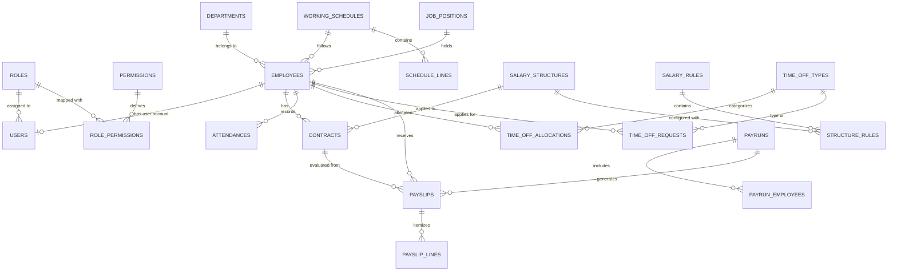

# 🚀 PeoplePay360 — Next-Gen HR & Enterprise Payroll Engine

[](https://nodejs.org/)
[](https://reactjs.org/)
[](https://vitejs.dev/)
[](https://tailwindcss.com/)
[](https://www.material-tailwind.com/)
[](https://www.mysql.com/)
[](LICENSE)

**PeoplePay360** is a comprehensive, production-grade **Human Resource Management (HRMS) & Payroll Automation Platform** inspired by enterprise ERP architectures (such as Odoo). It delivers full-lifecycle workforce management—from employee onboarding, contract lifecycle, dynamic working schedules, and attendance tracking to rule-based salary calculation, batch payrun execution, and executive analytics.

---

## 📑 Table of Contents

- [Core Capabilities & Modules](#-core-capabilities--modules)
- [System Architecture](#-system-architecture)
- [Tech Stack](#-tech-stack)
- [Database Schema & Data Flow](#-database-schema--data-flow)
- [Quick Start & Setup Guide](#-quick-start--setup-guide)
  - [Prerequisites](#prerequisites)
  - [1. Clone Repository](#1-clone-repository)
  - [2. Backend Setup & Database Migration](#2-backend-setup--database-migration)
  - [3. Frontend Setup](#3-frontend-setup)
- [Demo User Accounts](#-demo-user-accounts)
- [API Documentation Summary](#-api-documentation-summary)
- [Project Directory Structure](#-project-directory-structure)
- [Troubleshooting](#-troubleshooting)

---

## 🌟 Core Capabilities & Modules

### 1. 📊 Executive & Real-Time Analytics Dashboard
- **Live Workforce KPIs**: Active Headcount, Real-Time Attendance Rate, Monthly Gross Payroll Outflow, and Pending Leave Requests.
- **Interactive Visualizations**:
  - **Net Salary Trend Chart**: Historical monthly payroll expenditures powered by Recharts.
  - **Departmental Salary Distribution**: Bar charts showing salary costs by department.
  - **Payslip Status Donut Chart**: Breakdown of payslips across Draft, Computed, Confirmed, and Paid states.
  - **Attendance & Time-Off Overview Cards**: Daily presence ratios and active time-off tracking.

### 2. 👥 Employee Directory & 360° Profiles
- Comprehensive profiles with department hierarchy, manager relationships, contact info, job positions, and active status.
- **Tabbed 360° Employee Dossier**:
  - **Overview**: Personal info, contact details, organizational metadata.
  - **Contracts**: Full history of employment contracts and wages.
  - **Attendance**: Clock-in history, total worked hours, and status.
  - **Time Off**: Allocated vs. taken leave balances and pending requests.

### 3. 📜 Contract & Compensation Lifecycle
- Contract tracking across employment phases (`draft` ➔ `running` ➔ `expired` / `cancelled`).
- Association with assigned **Salary Structures** and **Working Schedules**.
- Strict point-in-time wage resolution preserving historical payroll auditability.

### 4. ⏱️ Working Schedules & Attendance Engine
- **Configurable Work Schedules**: Standard 40h workweeks, flexible schedules, and customized shift lines with daily start/end/break durations.
- **Smart Check-In / Check-Out Widget**: Real-time worked hours computation, automatic overtime detection, and attendance status tagging (`present`, `late`, `half_day`, `absent`).
- Department-wide attendance filtering and manager edit capabilities with audit tracking.

### 5. 🌴 Time Off & Leave Allocations
- Configurable leave types (Paid Time Off, Sick Leave, Unpaid Leave) with color coding and payroll deduction toggles.
- Quota allocation tracking per employee with validity period enforcement.
- Multi-tier approval workflow (`pending` ➔ `approved` / `rejected`).

### 6. 💰 Rule-Based Enterprise Payroll Engine
- **Salary Structures & Configurable Salary Rules**: Basic Wage, HRA (percentage-based), Special Allowances (fixed), Provident Fund (PF deductions), Professional Tax (PT).
- **Sequential Formula Evaluation**: Dynamic rule calculation honoring category hierarchies and percentage bases (e.g., `HRA = 40% of BASIC`, `PF = 12% of BASIC`).
- **Batch Payruns**:
  - Multi-employee payrun batching per pay period.
  - Automatic contract snapshot freezing.
  - Bulk payslip generation and computation.
  - Multi-stage approval workflow (`draft` ➔ `computed` ➔ `confirmed` ➔ `paid`).
- **Payslip Detail & Export**: Itemized earnings and deductions breakdown with ready-to-print views.

### 7. 🛡️ Role-Based Access Control (RBAC) & Security
- 5 distinct system roles with granular, data-driven permission codes:
  1. **Admin**: Full platform access, user management, and system configuration.
  2. **HR Manager**: Employee onboarding, department management, contract handling, and time-off approvals.
  3. **HR Payroll Manager**: Full payroll CRUD, salary structures, rule formulas, and payruns.
  4. **HR Payroll User**: Payrun review and payslip management.
  5. **Employee**: Self-service portal (personal attendance check-in, profile, and leave requests).
- Secure JWT-based authentication with bcrypt password hashing and token expiration.

---

## 🏗️ System Architecture

```
┌────────────────────────────────────────────────────────┐
│                   React 18 Frontend                    │
│      (Vite • Tailwind CSS • Material Tailwind • Recharts) │
└───────────────────────────┬────────────────────────────┘
                            │ HTTP / REST APIs (JSON)
                            │ Bearer JWT Auth Header
┌───────────────────────────▼────────────────────────────┐
│                  Express.js Backend                    │
│   (JWT Middleware • RBAC Perm Checks • Error Handler)  │
└──────┬────────────────────┬────────────────────┬───────┘
       │                    │                    │
┌──────▼──────┐      ┌──────▼──────┐      ┌──────▼──────┐
│ Auth & Users│      │ HR & Leaves │      │Payroll Engine│
└──────┬──────┘      └──────┬──────┘      └──────┬──────┘
       │                    │                    │
┌──────┴────────────────────┴────────────────────┴───────┐
│              MySQL 8.x Database (InnoDB)               │
│  (Tables • Foreign Keys • Triggers • Schema Views)    │
└────────────────────────────────────────────────────────┘
```

---

## 🛠️ Tech Stack

### Frontend
- **Framework**: [React 18](https://react.dev/) + [Vite 5](https://vitejs.dev/)
- **UI & Styling**: [Tailwind CSS 3](https://tailwindcss.com/) + [Material Tailwind](https://www.material-tailwind.com/)
- **Icons**: [@heroicons/react](https://heroicons.com/)
- **Charts & Data Viz**: [Recharts](https://recharts.org/)
- **Routing**: [React Router Dom v6](https://reactrouter.com/)
- **HTTP Client**: [Axios](https://axios-http.com/)

### Backend
- **Runtime**: [Node.js](https://nodejs.org/) (ES6+ / CommonJS)
- **Framework**: [Express.js v4](https://expressjs.com/)
- **Database Driver**: [mysql2](https://github.com/sidorares/node-mysql2) (Promise-based Connection Pool)
- **Security**: [bcrypt](https://www.npmjs.com/package/bcrypt) (Salt Rounds: 10), [jsonwebtoken](https://jwt.io/), [helmet](https://helmetjs.github.io/), [cors](https://www.npmjs.com/package/cors)
- **Logging**: [morgan](https://www.npmjs.com/package/morgan)

### Database
- **Engine**: MySQL 8.x (InnoDB with ACID transaction support)
- **Views**: `vw_payroll_summary`, `vw_attendance_overview`

---

## 🗄️ Database Schema & Data Flow



---

## ⚡ Quick Start & Setup Guide

### Prerequisites
- **Node.js**: v18.0.0 or higher
- **npm**: v9.0.0 or higher
- **MySQL Server**: v8.0+ running locally (e.g. MySQL Server, XAMPP, or Docker)

---

### 1. Clone Repository
```bash
git clone https://github.com/umesh1177/HRMS-PayRoll.git
cd HRMS-PayRoll
```

---

### 2. Backend Setup & Database Migration

1. Navigate to the `backend` directory and install dependencies:
   ```bash
   cd backend
   npm install
   ```

2. Create your `.env` configuration file in `backend/`:
   ```bash
   cp .env.example .env
   ```
   *Edit `.env` with your MySQL credentials:*
   ```env
   PORT=5000
   DB_HOST=localhost
   DB_USER=root
   DB_PASSWORD=YourMySQLPassword
   DB_NAME=peoplepay360
   DB_PORT=3306
   JWT_SECRET=super_secret_jwt_key_peoplepay360_hackathon_2026
   ```

3. Provision database schema and seed demo records:
   ```bash
   # Initialize tables, views, and permissions
   npm run init-db

   # (Optional / Re-run anytime) Populate demo employees, salary rules, & users
   npm run seed-db
   ```

4. Start the backend development server:
   ```bash
   npm run dev
   ```
   *Backend API will run at `http://localhost:5000/api/v1`.*

---

### 3. Frontend Setup

1. Open a new terminal, navigate to the `frontend` directory, and install dependencies:
   ```bash
   cd frontend
   npm install
   ```

2. Ensure `frontend/.env` is configured:
   ```env
   VITE_API_URL=http://localhost:5000/api/v1
   ```

3. Launch the Vite development server:
   ```bash
   npm run dev
   ```
   *Frontend UI will be live at `http://localhost:5173`.*

---

## 🔑 Demo User Accounts

Use these pre-configured accounts to evaluate different permission tiers:

| Role | Email Address | Password | Permissions Summary |
| :--- | :--- | :--- | :--- |
| **Admin** | `admin@peoplepay360.com` | `Admin@123` | Full system access, all modules & settings |
| **HR Manager** | `hrmanager@peoplepay360.com` | `HR@123` | Employee CRUD, contracts, time off approvals |
| **Payroll Manager**| `payrollmgr@peoplepay360.com`| `Payroll@123` | Full payroll engine, salary rules, payrun execution |
| **Employee** | `employee@peoplepay360.com` | `Emp@123` | Self-service profile, clock in/out, time-off requests |

*(Note: The login screen includes quick auto-fill buttons for fast testing.)*

---

## 📡 API Documentation Summary

All endpoints are versioned under the `/api/v1` base route:

### Authentication & Users (`/api/v1/auth`)
- `POST /login` — Authenticate user and issue JWT token
- `GET /me` — Retrieve active user profile and permissions
- `GET /roles` — List available user roles
- `GET /users` — Paginated user directory *(Admin only)*
- `POST /users` — Create new system user account *(Admin only)*

### Dashboard & Analytics (`/api/v1/dashboard`)
- `GET /kpis` — Real-time high-level metric cards
- `GET /payroll-summary` — Salary cost breakdown by department
- `GET /payslip-status-distribution` — Status distribution count for donut chart
- `GET /attendance-overview` — Today's attendance headcount & presence percentage
- `GET /timeoff-overview` — Department-level time off metrics
- `GET /net-salary-trend` — Historical monthly salary expenditure trend

### Employees (`/api/v1/employees`)
- `GET /` — List and search employees with pagination & filters
- `GET /:id` — Get 360° employee details (profile, contract, attendance, leaves)
- `POST /` — Onboard new employee
- `PUT /:id` — Update employee record
- `DELETE /:id` — Deactivate / archive employee

### Contracts (`/api/v1/contracts`)
- `GET /` — List employment contracts with status filter
- `POST /` — Create new contract linked to salary structure
- `PUT /:id` — Update contract wage or status
- `DELETE /:id` — Terminate / cancel contract

### Working Schedules & Attendance (`/api/v1/schedules`, `/api/v1/attendance`)
- `GET /schedules` — List working schedules with daily shift lines
- `POST /attendance/check-in` — Employee clock-in timestamp
- `POST /attendance/check-out` — Employee clock-out timestamp
- `GET /attendance` — Query attendance records by date range and department

### Time Off & Leaves (`/api/v1/timeoff`)
- `GET /types` — List configured leave types
- `GET /allocations` — Query employee leave balances
- `GET /requests` — List leave requests with status filters
- `POST /requests` — Submit leave request
- `PUT /requests/:id/approve` — Approve pending request
- `PUT /requests/:id/reject` — Reject pending request

### Payroll & Salary Rules (`/api/v1/payroll`)
- `GET /structures` — List salary structures
- `POST /structures` — Create custom salary structure
- `GET /rules` — List salary computation rules
- `POST /rules` — Create fixed/percentage salary rule
- `GET /payruns` — List monthly payrun batches
- `POST /payruns` — Generate new payrun batch
- `POST /payruns/:id/compute` — Compute all payslips for payrun
- `POST /payruns/:id/confirm` — Validate and finalize payrun
- `GET /payslips/:id` — Detailed itemized payslip breakdown

---

## 📂 Project Directory Structure

```
HRMS-PayRoll/
├── README.md                      # Comprehensive project documentation
├── backend/                       # Express.js REST API server
│   ├── .env.example               # Backend environment variable template
│   ├── package.json               # Backend dependencies and scripts
│   ├── database/                  # Database migration & seed SQL scripts
│   │   ├── schema.sql             # Full DDL schema (tables, views, indexes)
│   │   └── seed.sql               # Demo dataset (users, rules, structures)
│   └── src/
│       ├── server.js              # Server entry point
│       ├── app.js                 # Express app configuration & routing
│       ├── config/                # Database pool & migration runners
│       ├── controllers/           # API business logic controllers
│       ├── middleware/            # Auth, RBAC, error handling middlewares
│       ├── routes/                # Express API domain routes
│       └── services/              # Payroll calculation engine
└── frontend/                      # React 18 + Vite frontend
    ├── .env.example               # Frontend environment template
    ├── package.json               # Frontend dependencies and scripts
    ├── vite.config.js             # Vite build configuration
    ├── tailwind.config.js         # Tailwind CSS styling configuration
    └── src/
        ├── App.jsx                # Root application component
        ├── api/                   # Axios HTTP client instance
        ├── components/            # Reusable UI component modules
        │   ├── attendance/        # Check-in widget & logs
        │   ├── common/            # Layouts, Sidebar, Navbar
        │   ├── contracts/         # Contract forms & lists
        │   ├── dashboard/         # KPI cards & Recharts widgets
        │   ├── employees/         # Employee cards, forms & 360 views
        │   ├── payroll/           # Payruns, rules & payslip views
        │   └── timeoff/           # Leave request & allocation modals
        ├── context/               # AuthContext & State management
        └── pages/                 # Top-level view routes
```

---

## ❓ Troubleshooting

1. **Database connection failed (`ECONNREFUSED`)**:
   - Ensure your MySQL server service is started and running.
   - Verify `DB_PORT` (typically `3306` or `3307`) in `backend/.env`.

2. **Invalid Email or Password during Login**:
   - Run `npm run seed-db` inside the `backend` folder to ensure demo user password hashes are populated.
   - Verify that your MySQL user table has `active` status users.

3. **CORS Errors**:
   - Ensure `VITE_API_URL` in `frontend/.env` points to `http://localhost:5000/api/v1` and the backend server is running on port 5000.

---

## 📄 License

This project is licensed under the **ISC License**.
